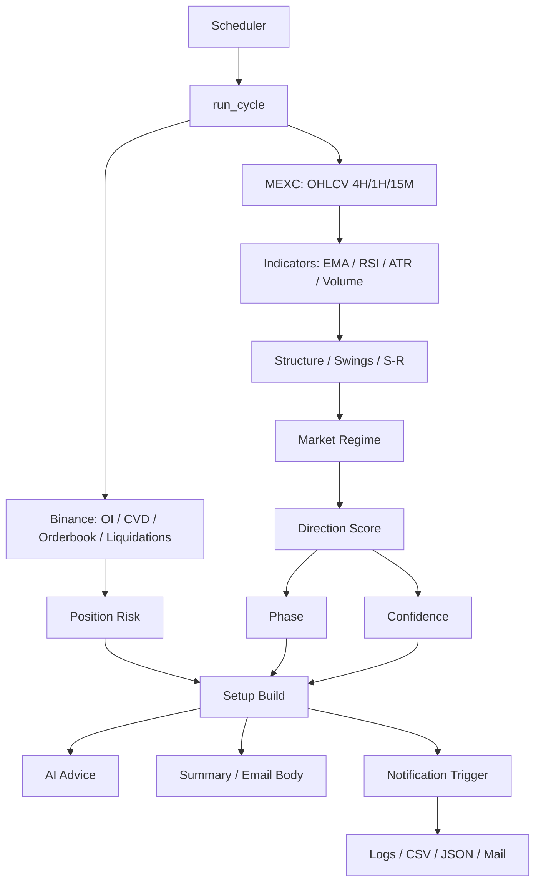
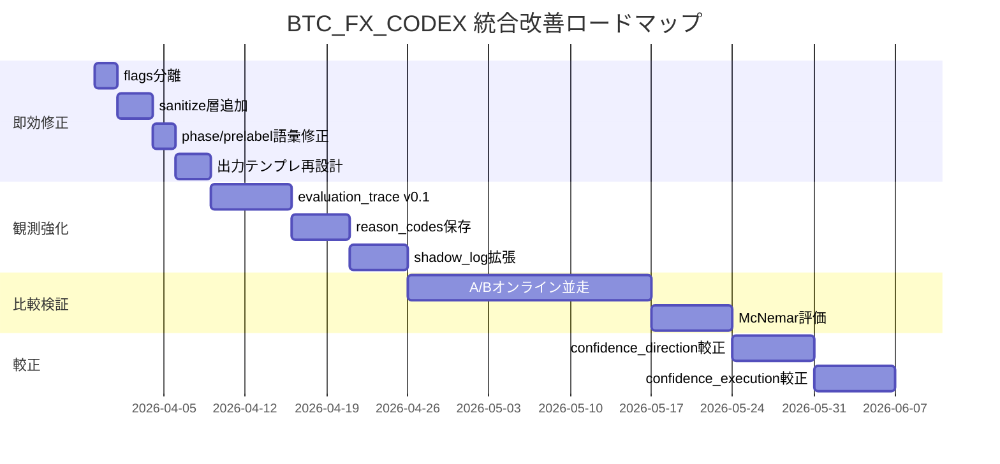

[!abstract] この文書について
この文書は、以下2本のレポートを統合し、**BTC_FX_CODEX の現行システムの構造理解・問題点の特定・改善優先順位・実装方針・評価方法**を、実務でそのまま使える形に一本化した最終版です。

- 設計思想の整理
- 実装上の不具合の特定
- 出力品質の改善方針
- A/Bテストと評価基盤の整備
- confidence の較正方針
- 実装ロードマップ

## 📋 目次
- [[#🎯 結論]]
- [[#🧭 本システムの位置づけ]]
- [[#🏗 現行システムの全体構造]]
- [[#🧩 現行システムの強み]]
- [[#⚠ 現在の主要な問題点]]
- [[#🔍 問題の中核 方向と執行の混線]]
- [[#🚨 構造的バグ 内部フラグ漏洩]]
- [[#📐 confidence の再定義]]
- [[#🛠 改善方針の統合版]]
- [[#📊 評価基盤の統合方針]]
- [[#🧪 A-Bテスト設計]]
- [[#🗺 実装ロードマップ]]
- [[#✅ 最終提言]]

# 🎯 結論
最優先で直すべきは、**出力の整流化**です。

具体的には次の3点が最重要です。

1. `no_trade_flags` と `risk_flags` を分離する  
2. 表示前に **sanitize層** を入れ、内部コードを必ず人間語へ変換する  
3. `confidence` を1本の曖昧な数値として扱うのをやめ、**方向**と**執行**を分けて再定義する

そのうえで、すぐに判定ロジックを大きく変えるのではなく、まずは **evaluation_trace による観測強化** を先に行い、次に **文面改善**、最後に **A/Bテストと較正** へ進むのが最も安全で合理的です。

---

# 🧭 本システムの位置づけ
BTC_FX_CODEX は、単純なAI予想機ではなく、次の3層で成り立つ監視・判定システムです。

1. **機械判定層**  
   ルールベースで方向・局面・位置・セットアップを計算する
2. **AI審査層**  
   JSON形式で機械判定の妥当性を審査する
3. **要約生成層**  
   件名・本文を自然文へ変換して通知する

つまり本質は、**ルールベース本体 + AI補助** です。  
学習済みモデル中心ではなく、現状は **手設計ロジック中心** の実装です。

---

# 🏗 現行システムの全体構造
システムは定時実行で1サイクルを回し、概ね次の順で処理します。



## 主な入力
- **MEXC**: 価格OHLCV（4H / 1H / 15M）
- **Binance**: OI、taker volume、orderbook、liquidation などの補助データ
- **AI層**: OpenAI API または Codex CLI ラッパー

## 主な内部出力
- `market_regime`
- `bias`
- `prelabel`
- `phase`
- `confidence`
- `setup`
- `signal_tier`
- 要約本文 / 通知文面

---

# 🧩 現行システムの強み
## 1. 方向と位置を分けて考えようとしている
設計思想として、
- **どちらへ動きやすいか**
- **今そこに入ってよいか**

を分けようとしている点は良いです。

これは裁量トレードでも本質的に重要で、システム設計として妥当です。

## 2. 補助データが豊富
OHLCVだけでなく、
- OI
- CVD
- 清算密度
- 板の壁
- 流動性回収の有無

を取り込んでいるので、単純なテクニカル監視より一段実務寄りです。

## 3. 評価基盤の芽がすでにある
`tools/log_feedback.py` により、
- direction の正誤
- ENTRY / WAIT / SKIP の妥当性
- TP1先着
- MFE / MAE

まで記録できるため、改善を「感覚」ではなく「統計」で進められる土台があります。

---

# ⚠ 現在の主要な問題点
## 1. 出力文面が概念を混ぜてしまっている
内部では分かれているはずの
- 方向
- 位置
- 実行準備
- confidence

が、要約文面で1つの結論のように圧縮されるため、ユーザーには「今すぐ入ってよい」という意味に読めることがあります。

## 2. 内部フラグが本文に漏れる
`bid_wall_close` のような内部識別子が本文にそのまま出るのは、明らかな品質事故です。

## 3. confidence が曖昧
現在の `confidence` は確率ではなく、加点減点の結果でしかありません。  
にもかかわらず、利用者には「勝率」や「信頼確率」のように見えやすいです。

## 4. バックテストが本番を十分再現できていない
OHLCV中心のバックテストでは、OI/CVD/板/清算などの本番重要因子が十分に再現されず、`position_risk` の実態と乖離しやすいです。

## 5. 評価系が分断している
- 簡易バックテスト
- 実運用ログ評価

の2系統があり、どちらを正本にするかが曖昧です。

---

# 🔍 問題の中核 方向と執行の混線
ここが最も重要です。

現在の出力では、
- `bias` = 方向の優位
- `prelabel` = 位置評価
- `setup.status` = 実行可能性
- `confidence` = 強度

という別々の概念が、最終文面では「いまの扱い」「入る条件」などの言葉に畳み込まれています。

その結果、たとえば本来は

- 方向はショート寄り
- ただし位置優位は弱い
- まだ sweep 待ち
- 今は watch

という状態でも、文面によっては **「ショート条件がかなりそろっている」** ように読めてしまいます。

これはロジックの問題というより、**出力インターフェースの設計問題** です。

## 改善原則
最終出力では、最低でも次の3行を分けるべきです。

- **方向**: 上 / 下 / 様子見
- **位置評価**: 良い / 微妙 / 待ち / 見送り
- **実行状態**: ready / watch / invalid

この3つを混ぜて1文にしないことが重要です。

---

# 🚨 構造的バグ 内部フラグ漏洩
これは設計論ではなく、修正対象のバグです。

## 問題の構造
現状では、`risk_flags` が `no_trade_flags` 側にも混入することで、役割が重複しています。

そのうえ要約側で、未知ラベルを安全に処理できず、内部識別子がそのまま表示される経路があります。

## 何が起きるか
- 同じ意味が二重に出る
- 一部は日本語化される
- 一部は英字識別子のまま残る
- 本文の信頼性が一気に下がる

## 修正方針
### 必須修正
- `no_trade_flags` = 見送り理由のみ
- `risk_flags` = 位置リスクのみ
- 両者を混ぜない

### 表示前の安全層
本文へ渡す前に必ず **sanitize層** を通す。

ルールは以下。
- 既知フラグ → 必ず自然な日本語へ変換
- 未知フラグ → 「内部フラグ：詳細省略」などに変換
- 原文の英字識別子をそのまま残さない

## 追加注意
このサニタイズは、LLM任せではなく **Python側で deterministic に行う** のが本命です。

---

# 📐 confidence の再定義
現在の `confidence` は、見た目上は「信頼度」ですが、実態は **ルールベースの強度指標** です。

したがって、これをそのまま確率のように見せるのは危険です。

## 提案
`confidence` を1本で扱わず、最低でも次の2系統に分けます。

### 1. `confidence_direction`
- 方向が正しい確率に近づける指標
- 最終的には `p(direction_correct_4h)` へ較正する

### 2. `confidence_execution`
- 実際に入った場合に TP1 が先着しやすいかの指標
- 最終的には `p(tp1_hit_first_24h)` へ較正する

## 較正方法
最小実装としては **Platt scaling** が現実的です。

```python
# confidence_strength -> p_dir_correct

def fit_platt(conf, y):
    # raw confidence と正誤ラベルから sigmoid を学習
    return a, b


def calibrate(conf, a, b):
    z = a * conf + b
    return 1 / (1 + exp(-z))
```

## 評価指標
- Brier score
- ECE
- reliability diagram

つまり将来的には、
- 強度としての confidence
- 確率としての calibrated probability

を区別して出すべきです。

---

# 🛠 改善方針の統合版
改善は、次の順番で進めるのが最も安全です。

## Phase 1 観測強化
ロジックを変えず、内部の「なぜ」を保存する。

### 追加すべきログ
- `evaluation_trace_version`
- `direction_score_shadow`
- `entry_quality_score_shadow`
- `confidence_components`
- `risk_component_scores`
- `reason_codes`

## Phase 2 出力整流化
ユーザーに見せる文章を構造的に改善する。

### やること
- flags 分離
- sanitize 層追加
- `phase` 表示ラベル整合
- `prelabel` 語彙の再設計
- 方向 / 位置 / 実行状態の明示的分離

## Phase 3 比較検証
オンライン並走で A/B を実施する。

### 基本方針
- A = 現行版
- B = 改善版
- 同一入力で同時評価
- 通知は A のみ、B は記録のみ

## Phase 4 較正
十分なログが集まった段階で confidence を較正する。

---

# 📊 評価基盤の統合方針
今後の正本は、**実運用ログ起点の評価** を中心にすべきです。

## 理由
簡易バックテストは便利ですが、OHLCVだけでは本番の `position_risk` を十分再現できません。

一方、`tools/log_feedback.py` は実運用に近い条件で、
- direction_outcome
- entry_outcome
- wait_outcome
- skip_outcome
- tp1_hit_first
- MFE / MAE

を算出できます。

したがって、改善判断の中心はまずこちらに置くべきです。

## 推奨データセット
- `logs/csv/trades.csv`
- `logs/csv/signal_outcomes.csv`
- `logs/csv/user_reviews.csv`
- 統合後の `shadow_log.csv`

---

# 🧪 A-Bテスト設計
## 原則
A/B は **同一時刻・同一入力** で比較するべきです。

独立サンプル比較ではなく、対応あり比較にすることで、必要サンプル数を抑えつつ有意差が見やすくなります。

## 推奨検定
- **McNemar検定**

## 比較対象
### 方向評価
- `direction_outcome`

### 実行評価
- `tp1_hit_first`

### 位置評価
- `entry_outcome`
- `wait_outcome`
- `skip_outcome`

## 実務KPI
- too_early rate
- low_value rate
- TP1 hit rate
- 通知A/B比
- data_quality_flag別の安定性

---

# 🗺 実装ロードマップ


---

# ✅ 最終提言
## まずやるべきこと
最初の改修は、次の4つで十分です。

1. `no_trade_flags` と `risk_flags` の分離
2. sanitize層の追加
3. 出力文の「方向 / 位置 / 実行状態」分離
4. evaluation_trace の保存

## 次にやること
- shadow_log の整備
- A/B並走
- McNemarで比較
- confidence の較正

## やってはいけないこと
- いきなり scoring を大改造する
- ログを取らずに閾値だけいじる
- confidence を確率扱いのまま運用する
- LLMにだけ表示品質を依存する

## 最終判断
このシステムは、現時点でも**設計思想そのものはかなり良い**です。  
問題は「AIが弱い」のではなく、**内部概念の整理が出力層で崩れていること**にあります。

したがって、最短で価値が出る道は、モデル刷新ではなく、

- 出力整流化
- 観測強化
- 比較可能化
- 較正

の順で積み上げることです。

これにより、BTC_FX_CODEX は「それっぽい予想通知」から、**説明可能で改善可能な判定システム**へ進化できます。
